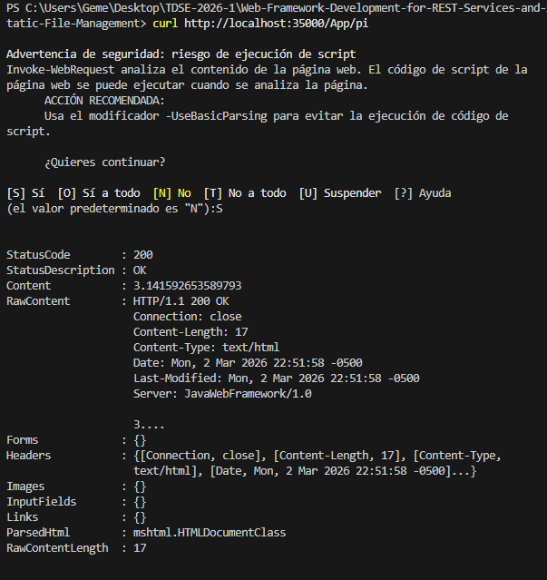
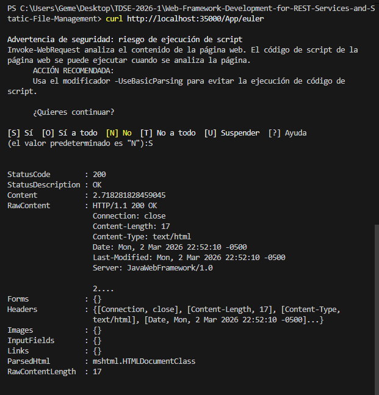
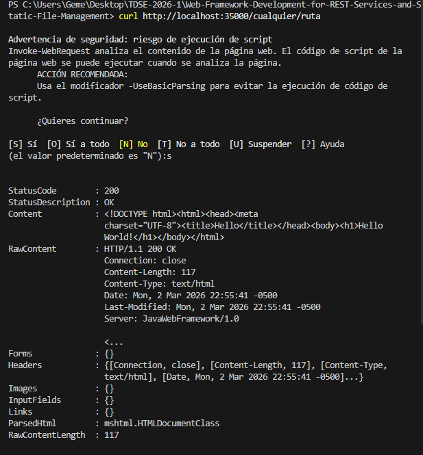
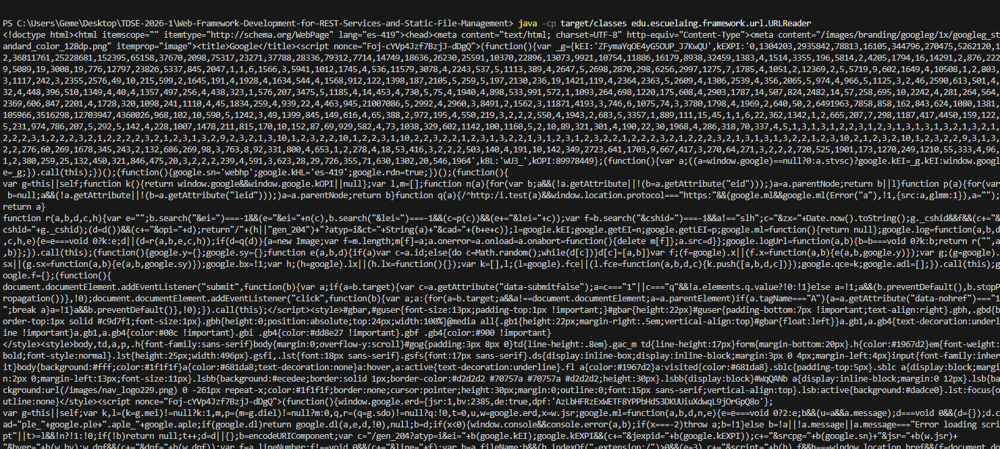
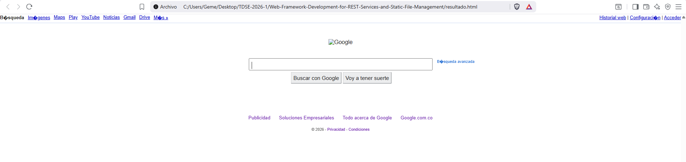
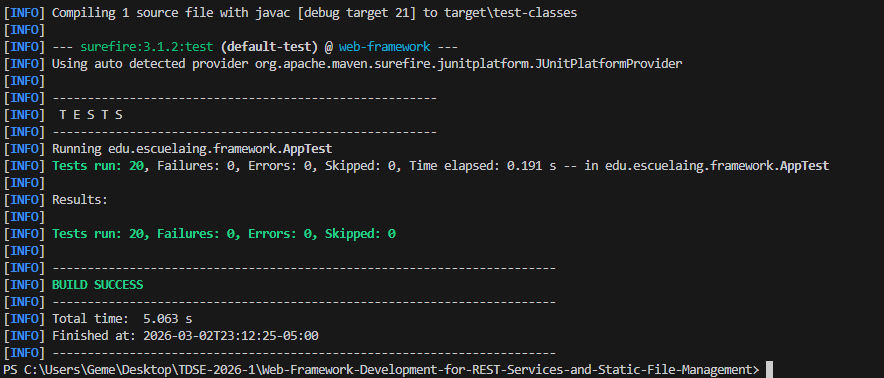

# Web Framework for REST Services and Static File Management

A lightweight Java web framework built from scratch using `ServerSocket`, supporting REST services defined via **lambda functions**, static file serving, TCP sockets, UDP datagrams, and RMI remote method invocation.

---

## Table of Contents
- [Architecture](#architecture)
- [Project Structure](#project-structure)
- [Requirements](#requirements)
- [Installation & Running](#installation--running)
- [Components](#components)
  - [1. Web Framework (REST + Static Files)](#1-web-framework-rest--static-files)
  - [2. URL Reading](#2-url-reading)
  - [3. TCP Sockets — Echo Client/Server](#3-tcp-sockets--echo-clientserver)
  - [4. UDP Datagrams — Time Client/Server](#4-udp-datagrams--time-clientserver)
  - [5. RMI — Remote Method Invocation](#5-rmi--remote-method-invocation)
- [Test Evidence](#test-evidence)

---

## Architecture

```
Client (Browser / curl)
        │  HTTP/1.1 Request
        ▼
┌─────────────────────┐
│     HttpServer      │  Listens on port 35000, spawns threads per request
└────────┬────────────┘
         │
         ├──▶ Spark.getRoute(path) ──▶ Route (lambda) ──▶ Response
         │
         ├──▶ StaticFileHandler.getFile(path) ──▶ Binary file bytes
         │
         └──▶ Default: "Hello World!" (200 OK)
```

### HTTP/1.1 Response format (MDN conventions)

```
HTTP/1.1 200 OK
Date: Sat, 09 Oct 2010 14:28:02 GMT
Server: JavaWebFramework/1.0
Last-Modified: Tue, 01 Dec 2009 20:18:22 GMT
Content-Length: 29769
Content-Type: text/html
```

### Key Classes

| Class | Responsibility |
|---|---|
| `App` | Entry point — registers routes and starts the server |
| `HttpServer` | TCP server based on professor's implementation, modified with full HTTP/1.1 headers |
| `Spark` | Registry of GET routes and static folder configuration |
| `Route` | Functional interface — lambda handlers for REST endpoints |
| `Request` | Parses HTTP method, path, and query parameters |
| `Response` | Holds status code and content type for the outgoing response |
| `StaticFileHandler` | Reads static files from `target/classes/webroot` |

---

## Project Structure

```
src/
├── main/
│   ├── java/edu/escuelaing/framework/
│   │   ├── App.java
│   │   ├── HttpServer.java
│   │   ├── Request.java
│   │   ├── Response.java
│   │   ├── Route.java
│   │   ├── Spark.java
│   │   ├── StaticFileHandler.java
│   │   ├── url/
│   │   │   ├── URLReader.java
│   │   │   └── URLConnectionReader.java
│   │   ├── sockets/
│   │   │   ├── EchoServer.java
│   │   │   └── EchoClient.java
│   │   ├── datagram/
│   │   │   ├── DatagramTimeServer.java
│   │   │   └── DatagramTimeClient.java
│   │   └── rmi/
│   │       ├── EchoRemote.java
│   │       ├── EchoServerImpl.java
│   │       └── EchoClientRMI.java
│   └── resources/
│       └── webroot/
│           └── index.html
└── test/
    └── java/edu/escuelaing/framework/
        └── AppTest.java
pom.xml
.gitignore
README.md
```

---

## Requirements

- Java 21+
- Maven 3.6+

---

## Installation & Running

### 1. Clone the repository
```bash
git clone https://github.com/<your-username>/web-framework.git
cd web-framework
```

### 2. Build with Maven
```bash
mvn clean package
```

### 3. Run the server
```bash
java -cp target/classes edu.escuelaing.framework.App
```

The server starts on **http://localhost:35000**

---

## Components

### 1. Web Framework (REST + Static Files)

The core of the project. An HTTP/1.1 server built on top of the professor's `HttpServer` base, extended to support REST services defined with lambda functions and static file serving.

#### Framework API

```java
// 1. Set the static files folder
staticfiles("/webroot");

// 2. Register GET routes with lambdas
get("/App/hello", (req, res) -> "Hello " + req.getValue("name"));
get("/App/pi",    (req, res) -> String.valueOf(Math.PI));
get("/App/euler", (req, res) -> String.valueOf(Math.E));

// 3. Start the server
HttpServer.main(args);
```

#### Available endpoints

| Method | URL | Response |
|--------|-----|----------|
| GET | `http://localhost:35000/App/hello?name=Pedro` | `Hello Pedro` |
| GET | `http://localhost:35000/App/pi` | `3.141592653589793` |
| GET | `http://localhost:35000/App/euler` | `2.718281828459045` |
| GET | `http://localhost:35000/index.html` | Static HTML page |
| GET | `http://localhost:35000/<any-unknown-path>` | `Hello World!` |

#### Server starting


---

#### index.html in browser


---

#### REST /App/hello?name=Daniel


---

#### REST /App/pi and /App/euler




---

#### Unknown path returns Hello World



---

### 2. URL Reading

Two utilities that demonstrate reading web content using Java's `URL` and `URLConnection` classes.

#### URLReader — reads a web page body

```bash
java -cp target/classes edu.escuelaing.framework.url.URLReader
```

#### URLConnectionReader — reads HTTP headers and saves body to file

```bash
java -cp target/classes edu.escuelaing.framework.url.URLConnectionReader http://www.google.com
```

Prints all HTTP response headers and saves the full body to `resultado.html`.

#### URLReader output




---

#### URLConnectionReader headers


---

#### resultado.html in browser


---

### 3. TCP Sockets — Echo Client/Server

Demonstrates bidirectional TCP socket communication. The server echoes back every message prefixed with `"Respuesta: "`.

#### Run the server (terminal 1)
```bash
java -cp target/classes edu.escuelaing.framework.sockets.EchoServer
```

#### Run the client (terminal 2)
```bash
java -cp target/classes edu.escuelaing.framework.sockets.EchoClient
```

Type any message and press Enter. Type `Bye.` to disconnect.

#### Echo Server and Client


---

### 4. UDP Datagrams — Time Client/Server

Demonstrates UDP datagram communication. The client sends a request and the server responds with the current date/time.

#### Run the server (terminal 1)
```bash
java -cp target/classes edu.escuelaing.framework.datagram.DatagramTimeServer
```

#### Run the client (terminal 2)
```bash
java -cp target/classes edu.escuelaing.framework.datagram.DatagramTimeClient
```

#### Datagram Server and Client


---

### 5. RMI — Remote Method Invocation

Demonstrates calling methods on a remote Java object through the RMI registry.

#### Step 1 — Start the RMI registry (terminal 1)
```bash
cd target/classes
rmiregistry 23000
```

#### Step 2 — Start the RMI server (terminal 2)
```bash
java -cp target/classes edu.escuelaing.framework.rmi.EchoServerImpl
```

#### Step 3 — Run the RMI client (terminal 3)
```bash
java -cp target/classes edu.escuelaing.framework.rmi.EchoClientRMI
```

Expected output:
```
desde el servidor: Hola, como estas?
```

#### RMI three terminals


---

## Test Evidence

### Run automated tests

```bash
mvn test
```

#### mvn test passing



---

### Manual test summary

| # | Test | Command | Expected result |
|---|------|---------|-----------------|
| 1 | Hello with name | `curl "http://localhost:35000/App/hello?name=Pedro"` | `Hello Pedro` |
| 2 | Pi value | `curl http://localhost:35000/App/pi` | `3.141592653589793` |
| 3 | Euler value | `curl http://localhost:35000/App/euler` | `2.718281828459045` |
| 4 | Static file | `curl http://localhost:35000/index.html` | HTML content |
| 5 | Unknown path | `curl http://localhost:35000/xyz` | `Hello World!` |
| 6 | Echo socket | EchoClient → EchoServer | `Respuesta: <message>` |
| 7 | UDP time | DatagramTimeClient → DatagramTimeServer | Current date/time |
| 8 | RMI echo | EchoClientRMI → EchoServerImpl | `desde el servidor: ...` |

---

## Design Decisions

- **Multithreaded**: Each HTTP client connection is handled in a separate thread, enabling concurrent requests.
- **Lambda routes**: The `Route` functional interface allows defining routes with clean, concise lambda syntax.
- **HTTP/1.1 headers**: All responses include `Date`, `Server`, `Last-Modified`, `Content-Length`, `Content-Type`, and `Connection: close` per the MDN HTTP spec.
- **Dispatch order**: Routes → Static files → Hello World. Unknown paths never return 404.
- **Subpackages**: Each networking concept (url, sockets, datagram, rmi) is isolated in its own subpackage for clarity and maintainability.